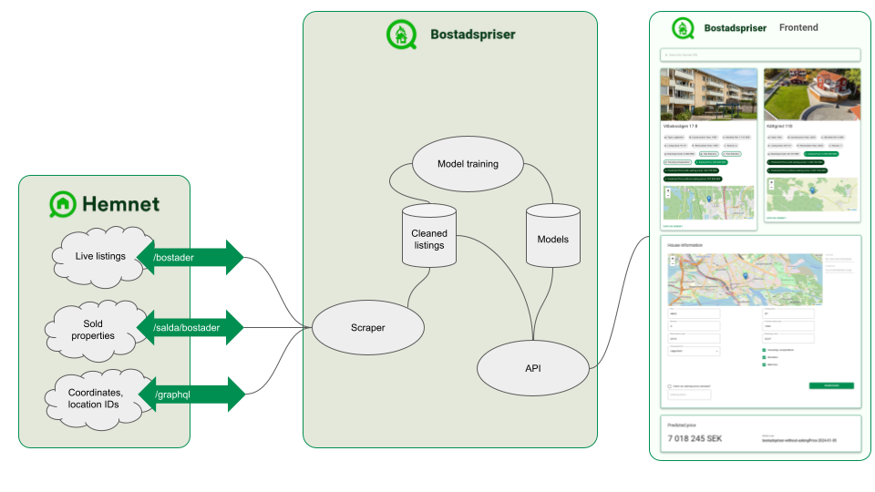

# 🏠️ bostadspriser

Property price scraper and predictor from Hemnet

A project by [Emil Karlsson](mailto:emilk2@kth.se) and [Pierre Le Fevre](mailto:pierrelf@kth.se), in the scope of ID2223 Scalable Machine Learning and Deep Learning at KTH.

## Introduction

This project is a web scraper for the Swedish property site Hemnet. It scrapes all the properties for sale in Sweden and stores them in a database. It also scrapes the sold properties and stores them in a database. The data is then used to train a machine learning model to predict the price of a property based on its features. The model is then used to predict the price of the properties for sale.

## Architecture
The architecture of the project follows the principles of serverless machine learning systems, with most of the components split into their own asynchronous pipelines. 

The architecture is as follows:

## Gathering data from Hemnet

Since Hemnet does not offer a public API, we had to scrape the data from the webpage. This came with a number of challenges, such as determining what has been scraped already and what has not. We solved this by storing the data in a MongoDB database in an iterative fashion. We started by finding location IDs that Hemnet uses and stored them in the database. Then, using these IDs, we constructed URLs that we could use to scrape the data. We then stored the data in the database. We then iterated over the database, finding the location IDs that had not been scraped yet, and repeated the process. For every search we did, we received up to 1000 listings. We then iterated over the listings, finding the ones that had not been scraped yet, and repeated the process.

This design is inherently asynchronous, which meant we could use a number of threads on a number of computers to scrape the data. 

We used a total of 5 computers, each with 10-50 threads, to scrape the data. We scraped the data for around 3 weeks, and ended up with a total of roughly 1.3 million listings, which is the total number of listings indicated by the Hemnet webpage at the time of writing.

Furthermore, since the scraping is essentially done by mimicking a search in the webpage, we had to design clever ways to search for listings that have not been scraped yet. 

Scraping pipelines are in the `scraping` folder. The code is written in Python, and can be run on any computer with systemd and Python 3 installed.

### Cleaning the data

The data we received from Hemnet was rather messy, as it seems the data entry is left to the brokers, many of which decide to enter crucial information in the free text fields. This created a lot of inconsistencies, such as missing or incorrect values. We had to clean the data before we could use it for training the model.

Due to the inconsitencies, we had to compromise on the amount of data we could use and the quality of the data (which is reflected in the quality of the model's performance). We ended up with around 1 million listings that we could use for training the model.

The cleaning pipelines can also be found in the `scraper` folder. These are scripts in Python which clean prod and backfill data, and insert the data into the database.

### Preparing the data

We added an intermediate step before starting to train the model. This included one-hot encoding the housing form, for instance `housingForm="Lägenhet"` or `housingForm="Villa"` became `isApartment=true/false` and `isHouse=true/false` respectively. This was also done for `housingCooperative`, which became `hasHousingCooperative`. This was deemded necessary since the model would not be able to interpret the string values, and there were far too many possible values to use one-hot encoding.

We also converted date fields, such as `constructionYear` and `soldDate`, to the number of years since the year 2000 to improve the performance of the model. 

The code for preparing the data is in `model/preapre.py`, and should run together with the model training pipeline.

## Training the model
Our goal with training the model was to try several different regression models and compare their performance. We used the following models:
- Linear regression
- Ridge regression
- Lasso regression
- Random forest regression
- Gradient boosting regression

### Multiple models
We also aimed to create versions of the models, depending on when they were trained, which was done by adding timestamps to the model.
But we took this a step futher since, depending on the parameters received in the API, differently trained models might be needed.

For example, when training a model with **asking price** (intial price set by the seller) as a feature, it gives entirely different results than when training a model without the asking price as a feature. Therefore, if a user would like to know "What should this cost based only on its properties?", it would use a model trained without asking price. If a user would like to know "What price will this end up with?", it would use a model trained with asking price.

### Hyperparameter tuning
We used a grid search to find the best hyperparameters for each model. We used the following hyperparameters:
- Linear regression: None
- Ridge regression: alpha
- Lasso regression: alpha
- Random forest regression: n_estimators, max_depth, min_samples_split, min_samples_leaf
- Gradient boosting regression: n_estimators, max_depth, min_samples_split, min_samples_leaf, learning_rate

### Training pipeline
The training happens in our `model` pipeline, which can be run on a schedule. The pipeline trains multiple models, testing with different hyperparameters, and stores the best model in a database. The pipeline also stores the predictions of the model in the database.

## Using the model

We created a website and a REST API to demonstrate the model. The website is available at [hempriser.se](https://hempriser.se/) and the API is available at [api.hempriser.se](https://api.hempriser.se/).

The website allows the user to see the predictions of a list of live and active property listings from Hemnet. The user can also input a custom property listing and see the prediction for that property, which is useful for users interested in selling their property.

The code for the website is in the `frontend` and `api` folders. The code is written in JavaScript and Python respectively.

### Transparency
We aimed for transparency in the model, which is why we included a page presenting all the features user in the model, as well as the model type (such as linear regression or random forest regression) and the hyperparameters used for that model.

## Results
### Model evaluation pipeline
To ensure we monitor for model drift and inference skew, we designed a batch inference pipeline that runs every hour. This pipeline takes all the sold listings since the model was trained that has not already been in a batch inference, and runs them through the model. The results are then stored in the database. Running it every hours means that, in practice, the batches are quite small (apart from the first one if the pipelilne is "shut down" for a while).
By ensuring that we only select the listings with injection time after the model was trained, we can ensure that we are not testing the model on data it has already seen.

The code for the batch inference pipeline is in the `inference` folder. The code is written in Python and can be run on any computer with systemd and Python 3 installed.

### Comparison against Booli

As a good sanity check, we wanted to compare to an established source of property price predictions in Sweden. Booli has a [free tool](https://www.booli.se/vardera) for predicting prices with most parameters overlapping ours. 
We designed a test set of properties to be quite broad, yet we could not test summer houses, plots nor farms as these are not supported by Booli. 

Most results were within 20% of the estimated price by Booli, however it is clear that the prices in Stockholm, Göteborg and Malmö are much more accurate than those outsite these larger cities. This is likely due to the fact that Booli (probably) has more data for these areas, which means that if we are close to Booli's predictions wherever we have enough data to train a model, we are likely to have built a robust model.

## Conclusion
### Final words
This project has been very insightful in the challenges that one might face when building a property price predictor. 
We have all used prediction services like those from Booli and Hemnet, and it is easy to be stumped by their shortcomings, but after going through all the scraping and model training, we can appreciate how large of a task this is.
By keeping this repository open-source, we hope to be able to help any future students wanting to use a property price dataset for Sweden.

### Future work
While we're happy with the result, there's always many improvment opportunities. Here are some of the improvements we wanted to explore:
- Search by geocoded addresses
- Show a confidence score (distance from closest listing, saturation of listings in the area) for each prediction
- Include more parameters such as plot area, floors, solar panels
- Feature "niceness" of listing using image classification
- Get plot and living area size automatically from satellite images/GIS
